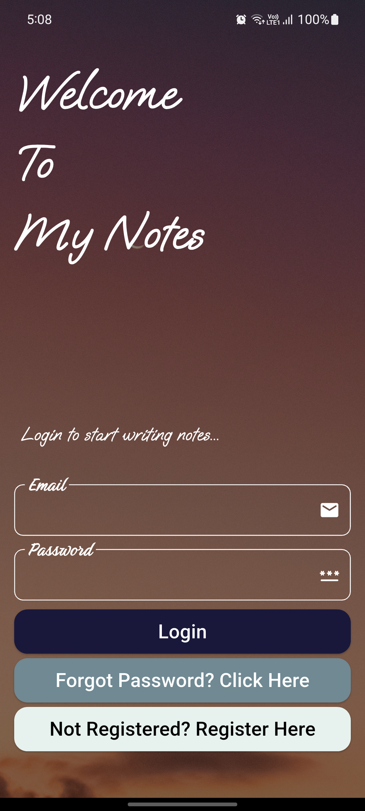
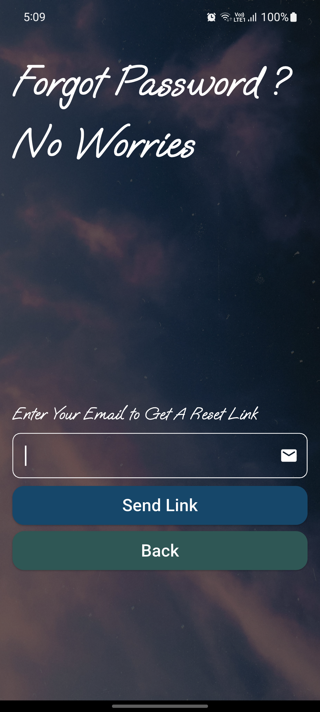
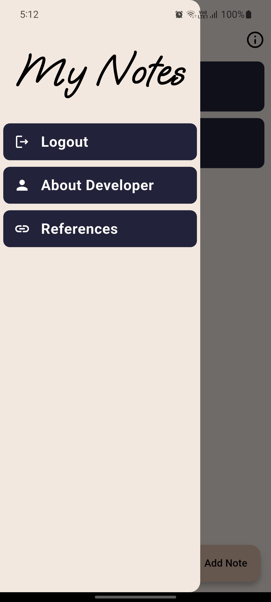
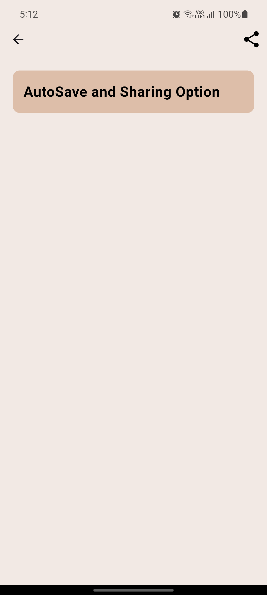

# My-Notes
A clean simple notes application built with Flutter, focused on usability and modern app architecture.

✨ Features
- Email & password authentication (Firebase)
- Create, edit, and manage personal notes
- Clean and responsive UI
- Secure user authentication

📱 Screenshots

  
  
  
  
  

⬇️ Download
👉 **[Download APK](https://github.com/Devsonar19/My-Notes/releases/latest)**

🛠 Tech Stack
- Flutter & Dart
- Firebase Authentication
- Cloud Firestore
- Bloc (State Management)
- SQLite
- Material Design

📚 Credits
- Background images from **Pexels**
- Fonts from **Google Fonts**

👨‍💻 Developer
**Dev Sonar**
This project was built as part of my Flutter learning journey and is actively being improved.

- GitHub: https://github.com/Devsonar19
